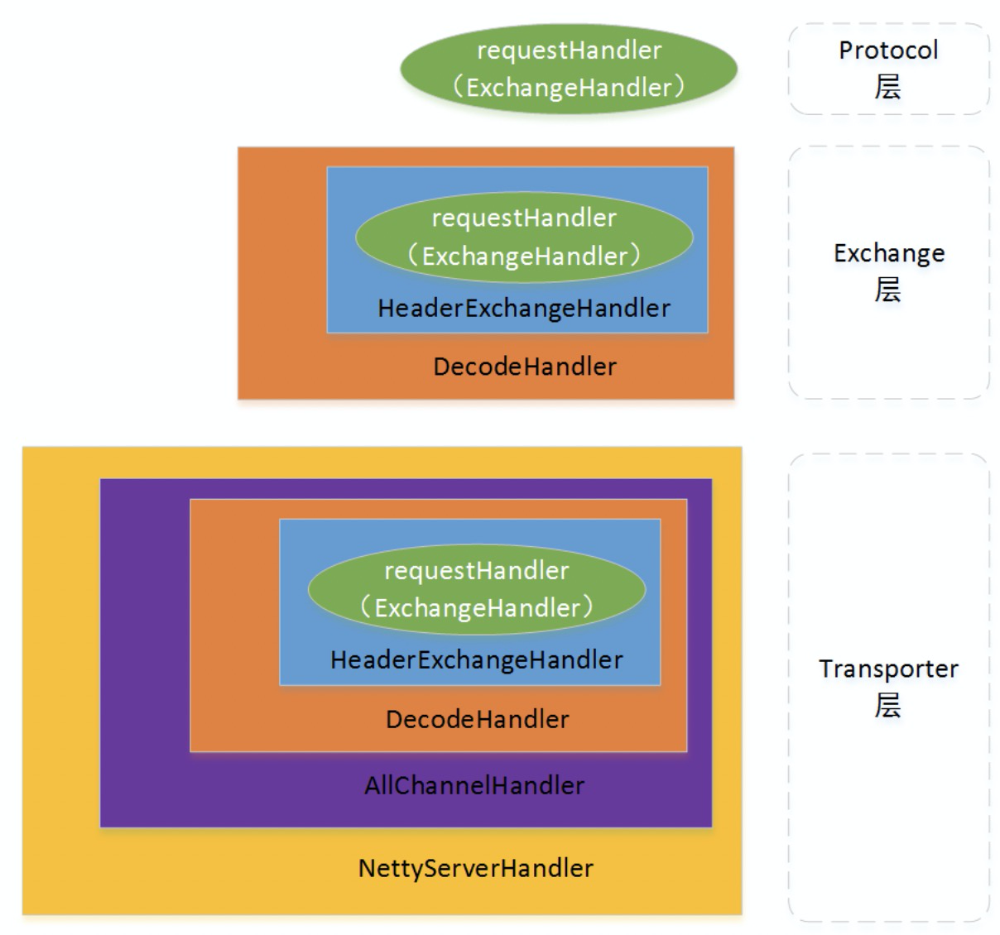

从Protocol层到Transporter层。纵深3层。从DubboProtocol构建，被逐层传递到NettyServer，然后在逐层返回。整个过程中，还被不断包裹，从同步到异步，不停变换用法和说法。总之，看得挺累，还是坚持逐个分析一遍。下面来说说。

先看一张图，是使用Dubbo Protocol并且使用Netty作为服务器的情况下Handler的整个包装过程。

 

解释下上面这张图

1.在DubboProtocol中构建ExchangeHandler命名requestHandler

2.在Exchange层做两次包装new DecodeHandler(new HeaderExchangeHandler(requestHandler))，具体参考类：HeaderExchanger

 ① 使用HeaderExchangeHandler做一次包装，HeaderExchangeHandler的作用是实现了Request和Response的概念，当接到received请求后，将请求转为reply。请参考类HeaderExchangeHandler，对这部分不熟悉的可以参考文章dubbo的exchange层

 ② 使用DecodeHandler做一次包装，DecodeHandler的作用是用来对Request Message和Response Message做解码操作，解码完成后才能给HeaderExchangeHandler使用。

3.在Exchange层包装后的Handler会被传递到Transporter层（NettyTransporter）并且把类型转换成ChannelHandler，因为ChannelHandler更为抽象。

4.Handler在Transporter层流转，会被传递到NettyServer中

5.在NettyServer中被AllChannelHandler包装，其作用是把NettyServer接收到的请求转移给Transporter层的线程池来处理。同步转异步。

6.Handler被再次NettyServerHandler包装，NettyServerHandler的父类是ChannelDuplexHandler。它属于Netty的Handler。由Netty来管理和调用其中的回调方法。Netty在接受到channelActive，channelRead等方法后，会把请求转移给Dubbo的Handler，这样每当请求过来，Netty的Handler接到请求就立马把数据和相关信息转交给Dubbo的Handler，由Dubbo的Handler来管理了。

上述的整个包装过程基本提现了Dubbo Protocol的Handler的转移过程。从DubboProtocol构建逐层向下传递。当Netty接到TCP请求后，调用过程又逐层向上传递。