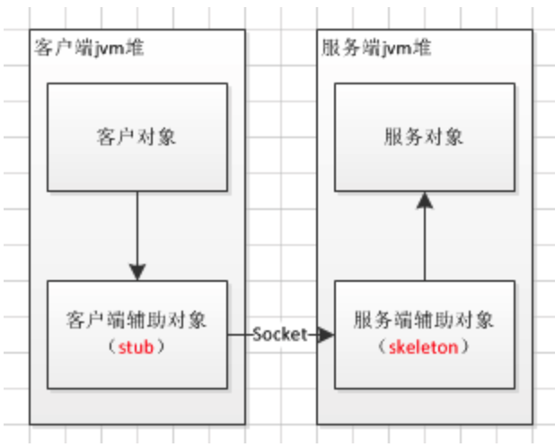

##RMI

###RMI简介

RMI用于不同虚拟机之间的通信，这些虚拟机可以在不同的主机上、也可以在同一个主机上，这里的通信可以理解为一个虚拟机上的对象调用另一个虚拟机上对象的方法。RMI要解决的是：是让客户端对远程方法的调用可以相当于对本地方法的调用而屏蔽其中关于远程通信的内容，即使在远程上，也和在本地上是一样的。


###实现原理
客户端只与代表远程主机中对象的Stub对象进行通信，丝毫不知道Server的存在。客户端只是调用Stub对象中的本地方法，Stub对象是一个本地对象，它实现了远程对象向外暴露的接口。客户端认为它是调用远程对象的方法，实际上是调用Stub对象中的方法。可以理解为Stub对象是远程对象在本地的一个代理，当客户端调用方法的时候，Stub对象会将调用通过网络传递给远程对象。



###实现流程

以一个简单案例来进一步理解RMI的使用。

1. 远程接口及实现

```java
/**
 * 远程服务对象接口必须继承Remote接口；同时方法必须抛出RemoteExceptino异常
 */
public interface Hello extends Remote {
    String sayHello(User user) throws RemoteException;
}
```

实现Hello接口：

```java
/**
 * 远程服务对象实现类写在服务端；必须继承UnicastRemoteObject或其子类
 */
public class HelloImpl extends UnicastRemoteObject implements Hello {

    public HelloImpl() throws RemoteException {
        super();
    }

    @Override
    public String sayHello(User user) throws RemoteException {
        System.out.println("this is server, hello:" + user.getName());
        return "hello";
    }

}

/**
 * 引用对象应该是可序列化对象，这样才能在远程调用的时候：
 * 1. 序列化对象
 * 2. 拷贝
 * 3. 在网络中传输
 * 4. 服务端反序列化
 * 5. 获取参数进行方法调用； 这种方式其实是将远程对象引用传递的方式转化为值传递的方式
 */
public class User implements Serializable {
    private static final long serialVersionUID = 2258201344880196063L;

    private String name;
    private int age;

    public String getName() {
        return name;
    }

    public void setName(String name) {
        this.name = name;
    }

    public int getAge() {
        return age;
    }

    public void setAge(int age) {
        this.age = age;
    }

}
```


服务端程序

```java
/**
 * 服务端程序
 **/
public class Server {

    public static void main(String[] args) throws Exception {

        // 1、创建一个远程对象，同时也会创建stub对象、skeleton对象
        Hello hello = new HelloImpl();

        // 2、启动注册服务
        LocateRegistry.createRegistry(8080);

        // 3、将stub引用绑定到服务地址上
        Naming.bind("//127.0.0.1:8080/wbh", hello);

        System.out.println("service bind already!!");

    }

}
```

客户端程序

```java
/**
 * 客户端程序
 *
 * @author wbh
 */
public class Client {
    public static void main(String[] args) throws Exception {

        // 1、获取远程对象
        Hello hello = (Hello) Naming.lookup("//127.0.0.1:8080/wbh");

        // 2、调用远程服务
        User user = new User();
        user.setName("james");
        System.out.println(hello.sayHello(user));

    }
}
```


###为什么项目不用RMI？

RMI（Remote Method Invocation：远程方法调用）是java在JDK1.1中实现的一组用于开发分布式应用程序的API，它大大增强了Java开发分布式应用的能力。但是RMI本身并没有集群的功能，就是同一个业务部署了多台服务器，他只会根据你配置的IP地址，端口去调用其中一台，不会去调用另外的，所以，怎么去有规则的调用另外的服务器就是负载均衡的工作了，这需要你自己实现。
总结：RMI能实现分布式服务，但单凭他自己不支持集群。


###RMI和RPC

**RMI只是RPC的一种Java实现。**

RPC（Remote Procedure Call Protocol）远程过程调用协议，通过网络从远程计算机上请求调用某种服务。可以这么理解：只要是通过网络从而调有远端的某种服务，那么这就是RPC，而不一定就是要http请求，tcp请求，udp请求，soap报文请求都可以，何况这几种请求是有关联的，因此当说自己的分布式系统通信是通过RPC实现的则可以继续问是什么协议/方式实现的RPC。


###RMI的特性

- 连接个数：多连接
- 连接方式：短连接
- 传输协议：TCP
- 传输方式：同步传输
- 序列化：Java 标准二进制序列化
- 适用范围：传入传出参数数据包大小混合，消费者与提供者个数差不多，可传文件。
- 适用场景：常规远程服务方法调用，与原生RMI服务互操作