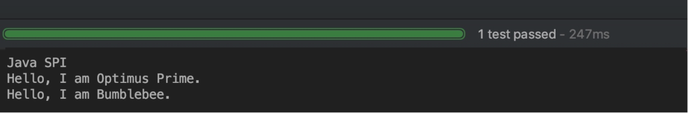
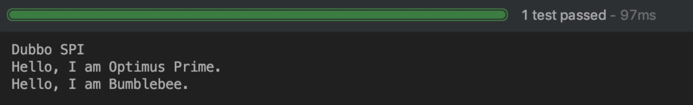
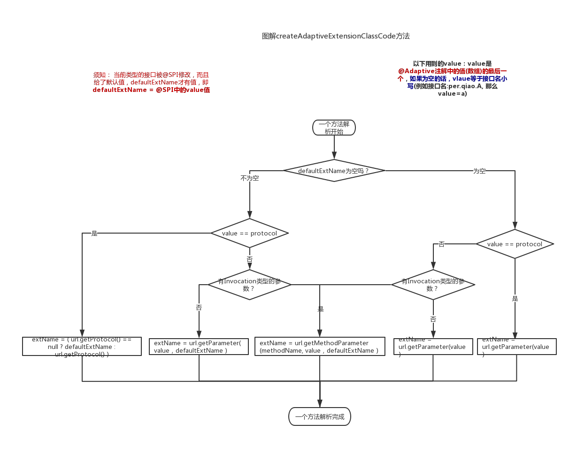

##Dubbo的SPI机制

Dubbo的SPI机制官方文档：

https://dubbo.apache.org/zh-cn/docs/source_code_guide/dubbo-spi.html

https://dubbo.apache.org/zh-cn/docs/source_code_guide/adaptive-extension.html

###1.简介

​		SPI 全称为 Service Provider Interface，是一种服务发现机制。SPI 的本质是将接口实现类的全限定名配置在文件中，并由服务加载器读取配置文件，加载实现类。这样可以在运行时，动态为接口替换实现类。正因此特性，我们可以很容易的通过 SPI 机制为我们的程序提供拓展功能。SPI 机制在第三方框架中也有所应用，比如 Dubbo 就是通过 SPI 机制加载所有的组件。不过，Dubbo 并未使用 Java 原生的 SPI 机制，而是对其进行了增强，使其能够更好的满足需求。在 Dubbo 中，SPI 是一个非常重要的模块。基于 SPI，我们可以很容易的对 Dubbo 进行拓展。如果大家想要学习 Dubbo 的源码，SPI 机制务必弄懂。接下来，我们先来了解一下 Java SPI 与 Dubbo SPI 的用法，然后再来分析 Dubbo SPI 的源码。


**SPI机制的作用**

​		使用Java SPI机制的优势是实现解耦，使得第三方服务模块的装配控制的逻辑与调用者的业务代码分离，而不是耦合在一起。应用程序可以根据实际业务情况启用框架扩展或替换框架组件。


###2.SPI 示例

####2.1 Java SPI 示例

前面简单介绍了 SPI 机制的原理，本节通过一个示例演示 Java SPI 的使用方法。使用Java SPI，需要遵循如下约定：

1. 服务提供者提供了接口的一种具体实现后，在jar包的META-INF/services目录下创建一个以“接口全限定名”为命名的文件，内容为实现类的全限定名；
2. 接口实现类所在的jar包放在主程序的classpath中；
3. 主程序通过java.util.ServiceLoder动态装载实现模块，它通过扫描META-INF/services目录下的配置文件找到实现类的全限定名，把类加载到JVM；
4. SPI的实现类必须携带一个不带参数的构造方法；

首先，我们定义一个接口，名称为 Robot。

```java
public interface Robot {
    void sayHello();
}
```

接下来定义两个实现类，分别为 OptimusPrime 和 Bumblebee。

```java
public class OptimusPrime implements Robot {
    
    @Override
    public void sayHello() {
        System.out.println("Hello, I am Optimus Prime.");
    }
}

public class Bumblebee implements Robot {

    @Override
    public void sayHello() {
        System.out.println("Hello, I am Bumblebee.");
    }
}	
```

接下来 META-INF/services 文件夹下创建一个文件，名称为 Robot 的全限定名 org.apache.spi.Robot。文件内容为实现类的全限定的类名，如下：

```
org.apache.spi.OptimusPrime
org.apache.spi.Bumblebee
```

做好所需的准备工作，接下来编写代码进行测试。

```java
public class JavaSPITest {

    @Test
    public void sayHello() throws Exception {
        ServiceLoader<Robot> serviceLoader = ServiceLoader.load(Robot.class);
        System.out.println("Java SPI");
        serviceLoader.forEach(Robot::sayHello);
    }
}
```

最后来看一下测试结果，如下：



从测试结果可以看出，我们的两个实现类被成功的加载，并输出了相应的内容。关于 Java SPI 的演示先到这里，接下来演示 Dubbo SPI。

####2.2 Dubbo SPI 示例

Dubbo 并未使用 Java SPI，而是重新实现了一套功能更强的 SPI 机制。Dubbo SPI 的相关逻辑被封装在了 ExtensionLoader 类中，通过 ExtensionLoader，我们可以加载指定的实现类。Dubbo SPI 所需的配置文件需放置在 META-INF/dubbo 路径下，配置内容如下。

```
optimusPrime = org.apache.spi.OptimusPrime
bumblebee = org.apache.spi.Bumblebee
```

与 Java SPI 实现类配置不同，Dubbo SPI 是通过键值对的方式进行配置，这样我们可以按需加载指定的实现类。另外，在测试 Dubbo SPI 时，需要在 Robot 接口上标注 @SPI 注解。下面来演示 Dubbo SPI 的用法：

```java
public class DubboSPITest {

    @Test
    public void sayHello() throws Exception {
        ExtensionLoader<Robot> extensionLoader = 
            ExtensionLoader.getExtensionLoader(Robot.class);
        Robot optimusPrime = extensionLoader.getExtension("optimusPrime");
        optimusPrime.sayHello();
        Robot bumblebee = extensionLoader.getExtension("bumblebee");
        bumblebee.sayHello();
    }
}
```

测试结果如下：




#### Java和Dubbo SPI两者区别

Dubbo改进了JDK标准的SPI的一下问题：

- JDK 标准的 SPI 会一次性实例化扩展点所有实现，如果有扩展实现初始化很耗时，但如果没用上也加载，会很浪费资源。
- dubbo spi增加了对扩展点 IoC 和 AOP 的支持，一个扩展点可以直接 setter 注入其它扩展点。
- 如果扩展点加载失败，连扩展点的名称都拿不到了。比如：JDK 标准的 ScriptEngine，通过 getName() 获取脚本类型的名称，但如果 RubyScriptEngine 因为所依赖的 jruby.jar 不存在，导致 RubyScriptEngine 类加载失败，这个失败原因被吃掉了，和 ruby 对应不起来，当用户执行 ruby 脚本时，会报不支持 ruby，而不是真正失败的原因。
- JDK的spi是通过System ClassLoader，Dubbo spi是通过Extend ClassLoader


###3.自适应扩展机制

​		在 Dubbo 中，很多拓展都是通过 SPI 机制进行加载的，比如 Protocol、Cluster、LoadBalance 等。有时，有些拓展并不想在框架启动阶段被加载，而是希望在拓展方法被调用时，根据运行时参数进行加载。这听起来有些矛盾。拓展未被加载，那么拓展方法就无法被调用（静态方法除外）。拓展方法未被调用，拓展就无法被加载。对于这个矛盾的问题，Dubbo 通过自适应拓展机制很好的解决了。自适应拓展机制的实现逻辑比较复杂，首先 Dubbo 会为拓展接口生成具有代理功能的代码。然后通过 javassist 或 jdk 编译这段代码，得到 Class 类。最后再通过反射创建代理类，整个过程比较复杂。

​		为了让大家对自适应拓展有一个感性的认识，下面我们通过一个示例进行演示。这是一个与汽车相关的例子，我们有一个车轮制造厂接口

WheelMaker：

```java
public interface WheelMaker {
    Wheel makeWheel(URL url);
}
```

WheelMaker 接口的自适应实现类如下：

```java
public class AdaptiveWheelMaker implements WheelMaker {
    public Wheel makeWheel(URL url) {
        if (url == null) {
            throw new IllegalArgumentException("url == null");
        }
        
    		// 1.从 URL 中获取 WheelMaker 名称
        String wheelMakerName = url.getParameter("Wheel.maker");
        if (wheelMakerName == null) {
            throw new IllegalArgumentException("wheelMakerName == null");
        }
        
        // 2.通过 SPI 加载具体的 WheelMaker
        WheelMaker wheelMaker = ExtensionLoader
            .getExtensionLoader(WheelMaker.class).getExtension(wheelMakerName);
        
        // 3.调用目标方法
        return wheelMaker.makeWheel(URL url);
    }
}
```

AdaptiveWheelMaker 是一个代理类，与传统的代理逻辑不同，AdaptiveWheelMaker 所代理的对象是在 makeWheel 方法中通过 SPI 加载得到的。makeWheel 方法主要做了三件事情：

1. 从 URL 中获取 WheelMaker 名称
2. 通过 SPI 加载具体的 WheelMaker 实现类
3. 调用目标方法

接下来，我们来看看汽车制造厂 CarMaker 接口与其实现类。

```java
public interface CarMaker {
    Car makeCar(URL url);
}

public class RaceCarMaker implements CarMaker {
    WheelMaker wheelMaker;
 
    // 通过 setter 注入 AdaptiveWheelMaker
    public setWheelMaker(WheelMaker wheelMaker) {
        this.wheelMaker = wheelMaker;
    }
 
    public Car makeCar(URL url) {
        Wheel wheel = wheelMaker.makeWheel(url);
        return new RaceCar(wheel, ...);
    }
}
```

RaceCarMaker 持有一个 WheelMaker 类型的成员变量，在程序启动时，我们可以将 AdaptiveWheelMaker 通过 setter 方法注入到 RaceCarMaker 中。在运行时，假设有这样一个 url 参数传入：

```url
dubbo://192.168.0.101:20880/XxxService?wheel.maker=MichelinWheelMaker
```

RaceCarMaker 的 makeCar 方法将上面的 url 作为参数传给 AdaptiveWheelMaker 的 makeWheel 方法，makeWheel 方法从 url 中提取 wheel.maker 参数，得到 MichelinWheelMaker。之后再通过 SPI 加载配置名为 MichelinWheelMaker 的实现类，得到具体的 WheelMaker 实例。

上面的示例展示了自适应拓展类的核心实现 ---- 在拓展接口的方法被调用时，通过 SPI 加载具体的拓展实现类，并调用拓展对象的同名方法。接下来，我们深入到源码中，探索自适应拓展类生成的过程。

###4.@Adaptive注解

引用dubbo官方文档的一段话：

 Adaptive 可注解在类或方法上。当 Adaptive 注解在类上时，Dubbo 不会为该类生成代理类。注解在方法（接口方法）上时，Dubbo 则会为该方法生成代理逻辑。Adaptive 注解在类上的情况很少，在 Dubbo 中，仅有两个类被 Adaptive 注解了，分别是 AdaptiveCompiler 和 AdaptiveExtensionFactory。此种情况，表示拓展的加载逻辑由人工编码完成。更多时候，Adaptive 是注解在接口方法上的，表示拓展的加载逻辑需由框架自动生成。


**为什么要设计adaptive？注解在类上和注解在方法上的区别？**

 adaptive设计的目的是为了识别固定已知类和扩展未知类。

1. 注解在类上：代表人工实现，实现一个装饰类（设计模式中的装饰模式），它主要作用于固定已知类，

   目前整个系统只有2个， AdaptiveCompiler，AdaptiveExtensionFactory

   - 为什么AdaptiveCompiler这个类是固定已知的？因为整个框架仅支持Javassist和JdkCompiler。
   - 为什么AdaptiveExtensionFactory这个类是固定已知的？因为整个框架仅支持2个objFactory,一个是spi,另一个是spring

2. 注解在方法上：代表自动生成和编译一个动态的Adpative类，它主要是用于SPI，因为spi的类是不固定、未知的扩展类，所以设计了动态$Adaptive类.
   例如 Protocol的spi类有 injvm dubbo registry filter listener等等 很多扩展未知类，
   它设计了Protocol$Adaptive的类，通过ExtensionLoader.getExtensionLoader(Protocol.class).getExtension(spi类);来提取对象

####注解在接口上

​		在接口上，在调用getAdaptiveExtension方法时，直接返回该类（不会去动态生成代理类），然后执行IOC；

####注解在方法上

**在方法上会生成代理代理类**

关于createAdaptiveExtensionClassCode方法

1. 至少有一个方法被@Adaptive修饰

2. 被@Adaptive修饰得方法得参数 必须满足参数中有一个是URL类型，或者有至少一个参数有一个“公共且非静态的返回URL的无参get方法”

3. @Adaptive注解中的值这里我叫它value，value可以是一个数组，如果为空的话，vlaue等于接口名小写(例如接口名:per.qiao.A, 那么value=a)

   **获取扩展名图如下**：

   

这里value表示@Adaptive注解的值(数组)中最后一个value, 如果该数组为空，则value等于接口名小写

java生成动态类的模板

```java
package <扩展点接口所在包>;

public class <扩展点接口名>$Adpative implements <扩展点接口> {

  public <有@Adaptive注解的接口方法>(<方法参数>) {
      if(是否有URL类型方法参数?) 使用该URL参数
      else if(是否有方法类型上有URL属性) 使用该URL属性
      <else 在加载扩展点生成自适应扩展点类时抛异常，即加载扩展点失败！>

      if(获取的URL == null) {
          throw new IllegalArgumentException("url == null");
      }

       //...获取扩展点名  图解如上

       <接口> extension = (接口) ExtensionLoader.getExtensionLoader(接口).getExtension(扩展点名);
       extension.<有@Adaptive注解的接口方法>(<方法参数>)
  }

  public <无@Adaptive注解的接口方法>(<方法参数>) {
      throw new UnsupportedOperationException("is not adaptive method!");
  }
}
```

小结：

1. 一个扩展文件内只能有一个扩展类被@Adaptive修饰，而且还需要有其他的初@Adaptive和AOP扩展之外的至少一个其他扩展

2. @Adaptive如果方在类上，那么cachedAdaptiveClass就等于该类

   Holder cachedAdaptiveInstance就包装这该类如果标注在方法上，那么该方法必须有参数为ulr或者参数有返回url的方法，并且会生成动态文件


###5.@Activate注解


####一. 使用示例

```xml
<dependency>
   <groupId>com.alibaba</groupId>
   <artifactId>dubbo</artifactId>
   <version>2.5.3</version>
</dependency>
```

1. shuqi.dubbotest.spi.adaptive.AdaptiveExt1 作为需要被扩展的接口，注意要加上@SPI注解

```java
package shuqi.dubbotest.spi.activate;

import com.alibaba.dubbo.common.extension.SPI;

@SPI
public interface ActivateExt1 {
    String echo(String msg);
}
```

2. 上面接口的五个实现类

* ActivateExt1Impl1

```java
@Activate(group = {"default_group"})
public class ActivateExt1Impl1 implements ActivateExt1 {
    public String echo(String msg) {
        return msg;
    }
}
```

* ##### GroupActivateExtImpl

```java
@Activate(group = {"group1", "group2"})
public class GroupActivateExtImpl implements ActivateExt1 {
    public String echo(String msg) {
        return msg;
    }
}
```

* ##### OrderActivateExtImpl1

```java
@Activate(order = 2, group = {"order"})
public class OrderActivateExtImpl1 implements ActivateExt1 {
    public String echo(String msg) {
        return msg;
    }
}
```

* ##### OrderActivateExtImpl2

```java
@Activate(order = 1, group = {"order"})
public class OrderActivateExtImpl2 implements ActivateExt1 {
    public String echo(String msg) {
        return msg;
    }
}
```

* ##### ValueActivateExtImpl

```java
@Activate(value = {"value1"}, group = {"value"})
public class ValueActivateExtImpl implements ActivateExt1 {
    public String echo(String msg) {
        return msg;
    }
}
```

3. 在Resource目录下，添加/META-INF/dubbo/internal/shuqi.dubbotest.spi.activate.ActivateExt1文件，里面的内容

```csharp
group=shuqi.dubbotest.spi.activate.GroupActivateExtImpl
value=shuqi.dubbotest.spi.activate.ValueActivateExtImpl
order1=shuqi.dubbotest.spi.activate.OrderActivateExtImpl1
order2=shuqi.dubbotest.spi.activate.OrderActivateExtImpl2
shuqi.dubbotest.spi.activate.ActivateExt1Impl1
```

####测试

测试一：@Activate注解中声明group

```java
@Test
public void testDefault() {
  ExtensionLoader<ActivateExt1> loader = ExtensionLoader.getExtensionLoader(ActivateExt1.class);
  URL url = URL.valueOf("test://localhost/test");
  //查询组为default_group的ActivateExt1的实现
  List<ActivateExt1> list = loader.getActivateExtension(url, new String[]{}, "default_group");
  System.out.println(list.size()); 
  System.out.println(list.get(0).getClass());
}

1
class shuqi.dubbotest.spi.activate.ActivateExt1Impl1
```

测试二：@Activate注解中声明多个group

```java
@Test
public void test2() {
  URL url = URL.valueOf("test://localhost/test");
  //查询组为group2的ActivateExt1的实现
  List<ActivateExt1> list = ExtensionLoader.getExtensionLoader(ActivateExt1.class).getActivateExtension(url, new String[]{}, "group2");
  System.out.println(list.size());
  System.out.println(list.get(0).getClass());
}

测试结果：
1
class shuqi.dubbotest.spi.activate.GroupActivateExtImpl
```


测试三：@Activate注解中声明了group与value

```java
@Test
public void testValue() {
  URL url = URL.valueOf("test://localhost/test");
  //根据   key = value1,group =  value
  //@Activate(value = {"value1"}, group = {"value"})来激活扩展
  url = url.addParameter("value1", "value");
  List<ActivateExt1> list = ExtensionLoader.getExtensionLoader(ActivateExt1.class).getActivateExtension(url, new String[]{}, "value");  
  System.out.println(list.size());
  System.out.println(list.get(0).getClass());
}

测试结果：
1
class shuqi.dubbotest.spi.activate.ValueActivateExtImpl
```


测试四：@Activate注解中声明了order,低的排序优先级搞

```java
@Test
public void testOrder() {
  URL url = URL.valueOf("test://localhost/test");
  List<ActivateExt1> list = ExtensionLoader.getExtensionLoader(ActivateExt1.class).getActivateExtension(url, new String[]{}, "order");
  System.out.println(list.size());
  System.out.println(list.get(0).getClass());
  System.out.println(list.get(1).getClass());
}

测试结果：
2
class shuqi.dubbotest.spi.activate.OrderActivateExtImpl2
class shuqi.dubbotest.spi.activate.OrderActivateExtImpl1
```


### 结论：

> 从上面的几个测试用例，可以得到下面的结论：
>
> 1. 根据loader.getActivateExtension中的group和搜索到此类型的实例进行比较，如果group能匹配到，就是我们选择的，也就是在此条件下需要激活的。
> 2.  @Activate中的value是参数是第二层过滤参数（第一层是通过group），在group校验通过的前提下，如果URL中的参数（k）与值（v）中的参数名同@Activate中的value值一致或者包含，那么才会被选中。相当于加入了value后，条件更为苛刻点，需要URL中有此参数并且，参数必须有值。
> 3. @Activate的order参数对于同一个类型的多个扩展来说，order值越小，优先级越高。


以Protocol介绍自适应扩展机制原理


Dubbo中Protocol接口有以下三大类实现：

* 服务注册实现：RegistryProtocol

* 装饰器类：ProtocolListenerWrapper、ProtocolFilterWrapper

* 具体协议实现：DubboProtocol、InjvmProtocol、RmiProtocol、RedisProtocol、MemcachedProtocol、WebServiceProtocol、HttpProtocol、HessianProtocol、RestProtocol

RegistryProtocol是用于向注册中心注册服务的协议，它持有一个Dubbo具体协议实现，通过Dubbo SPI的IOC特性会自动将协议实现注入进来。


Dubbo启动后，Protocol的实现类组装结构及调用顺序如下：

```java
AdaptiveProtocol

	-ProtocolListenerWrapper
		-ProtocolFilterWrapper
		  -RegistryProtocol
			  
			  -ProtocolListenerWrapper
					-ProtocolFilterWrapper
			  		-DubboProtocol
```


