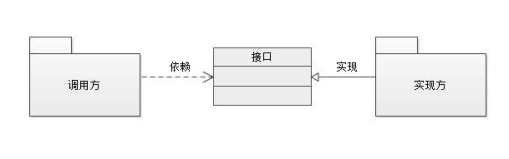
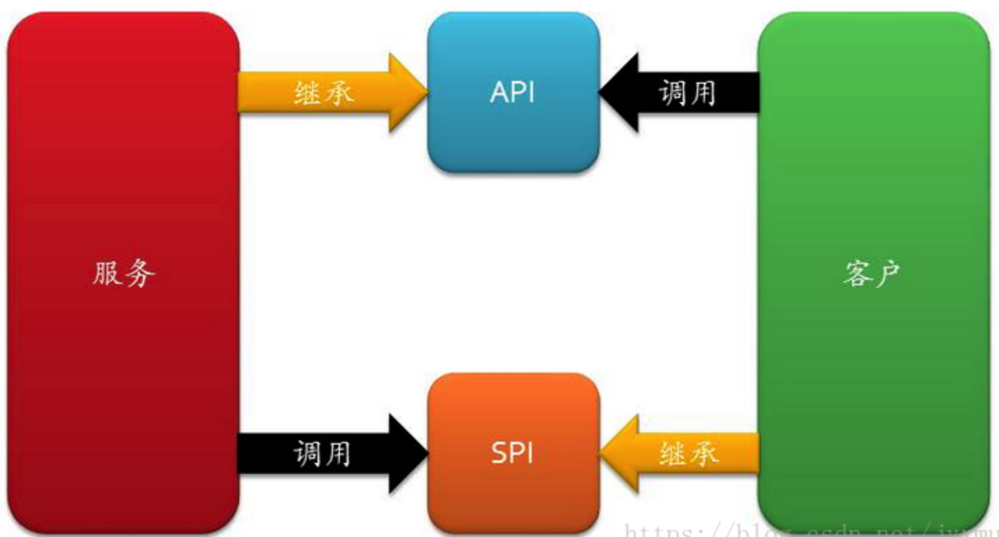

# SPI 与 API的区别


## 背景

Java 中区分 API 和 SPI，通俗的讲：API 和 SPI 都是相对的概念，他们的差别只在语义上，API 直接被应用开发人员使用，SPI 被框架扩展人员使用

## 理解

API （Application Programming Interface）

- 大多数情况下，都是**实现方**来制定接口并完成对接口的不同实现，**调用方**仅仅依赖却无权选择不同实现。

SPI (Service Provider Interface)

- 而如果是**调用方**来制定接口，**实现方**来针对接口来实现不同的实现。**调用方**来选择自己需要的实现方。

## 从面向接口编程说起



当我们选择在**调用方** 和 **实现方** 中间引入 接口。上图没有给出“接口”应该位于哪个“包”中，从纯粹的可能性上考虑，我们有三种选择：

1. 接口位于**实现方**所在的包中
2. 接口位于**调用方**所在的包中
3. 接口位于独立的包中

### 1、接口位于【调用方】所在的包中

对于类似这种情况下接口，我们将其称为 SPI, SPI的规则如下：

- 概念上更依赖调用方。
- 组织上位于调用方所在的包中。
- 实现位于独立的包中。

常见的例子是：插件模式的插件。如：

- 数据库驱动 Driver
- 日志 Log
- dubbo扩展点开发

### 2、接口位于【实现方】所在的包中

对于类似这种情况下的接口，我们将其称作为API，API的规则如下：

- 概念上更接近实现方。
- 组织上位于实现方所在的包中。

### 3、接口位于独立的包中

如果一个“接口”在一个上下文是API，在另一个上下文是SPI，那么你就可以这么组织

需要注意的事项
SPI 和 API 也不一定是接口，我这里都是指狭义的具体的接口。



## Java类库中的实例

```java
Class.forName("com.mysql.jdbc.Driver");
Connection conn = DriverManager.getConnection(

              "jdbc:mysql://localhost:3306/test", "root", "123456");
Statement stmt = conn.createStatement();

ResultSet rs = stmt.executeQuery("select * from Users");
```

说明：java.sql.Driver 是 Spi，com.mysql.jdbc.Driver 是 Spi 实现，其它的都是 Api。