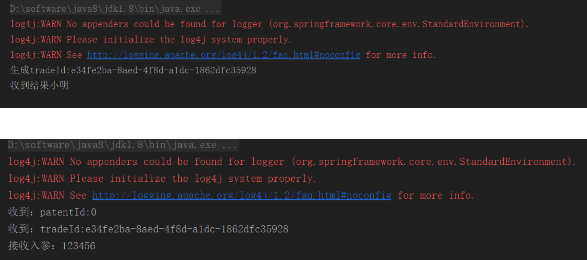

## 一、实现Filter接口

摘自：https://www.cnblogs.com/wangzhuxing/p/9738906.html


### 1、消费者过滤器:ConsumerTraceFilter.java

```java
package com.dubbo.demo.Filter;

import com.alibaba.dubbo.rpc.*;

import java.util.Map;
import java.util.UUID;

public class ConsumerTraceFilter implements Filter {

    @Override
    public Result invoke(Invoker<?> invoker, Invocation invocation) throws RpcException {
        Map<String, String> stringStringMap = invocation.getAttachments();
        // 设置参数
        stringStringMap.put("patentId","0");
        stringStringMap.put("traceId",UUID.randomUUID().toString());
        System.out.println("生成tradeId:"+stringStringMap.get("traceId"));
        return invoker.invoke(invocation);
    }
}
```


### 2、生产者过滤器:ProviderTraceFilter.java

```java
package com.dubbo.demo.Filter;

import com.alibaba.dubbo.rpc.*;

import java.util.Map;

public class ProviderTraceFilter implements Filter {

    public Result invoke(Invoker<?> invoker, Invocation invocation) throws RpcException {
        Map<String, String> stringStringMap = invocation.getAttachments();
        // 接收参数
        System.out.println("收到：patentId:"+stringStringMap.get("patentId"));
        System.out.println("收到：tradeId:"+stringStringMap.get("traceId"));
        return invoker.invoke(invocation);
    }
}
```


## 二、配置SPI Filter扩展文件


### 1、生产者配置

在目录：resources/META-INF/dubbo/ 创建com.alibaba.dubbo.rpc.Filter（纯文本文件.txt）

内容：

```
traceFilter=com.dubbo.demo.Filter.ProviderTraceFilter
```


### 2、消费者配置

在目录：resources/META-INF/dubbo/ 创建com.alibaba.dubbo.rpc.Filter（纯文本文件.txt）

内容：

```
traceFilter=com.dubbo.demo.Filter.ConsumerTraceFilter
```


## 三、配置dubbo文件


### 1、生产者


```xml
<?xml version="1.0" encoding="UTF-8"?>
<beans xmlns="http://www.springframework.org/schema/beans"
       xmlns:xsi="http://www.w3.org/2001/XMLSchema-instance"
       xmlns:dubbo="http://code.alibabatech.com/schema/dubbo"
       xsi:schemaLocation="http://www.springframework.org/schema/beans
        http://www.springframework.org/schema/beans/spring-beans.xsd
        http://code.alibabatech.com/schema/dubbo
        http://code.alibabatech.com/schema/dubbo/dubbo.xsd">

    <!--过滤器配置-->
    <dubbo:provider filter="traceFilter" />
    <!--dubbo应用程序命名-->
    <dubbo:application name="dubbo-demo-provider"/>
    <!--dubbo注册地址-->
    <dubbo:registry address="zookeeper://192.168.1.100:2181"/>
    <!--dubbo协议地址-->
    <dubbo:protocol name="dubbo" port="20880"/>
    <!--接口声明-->
    <dubbo:service interface="com.dubbo.demo.api.DemoRpcService" ref="demoRpcService"/>
    <bean id="demoRpcService" class="com.dubbo.demo.DemoRpcServiceImpl"/>
</beans>
```


### 2、消费者

```xml
<?xml version="1.0" encoding="UTF-8"?>
<beans xmlns="http://www.springframework.org/schema/beans"
       xmlns:xsi="http://www.w3.org/2001/XMLSchema-instance"
       xmlns:dubbo="http://code.alibabatech.com/schema/dubbo"
       xsi:schemaLocation="http://www.springframework.org/schema/beans
        http://www.springframework.org/schema/beans/spring-beans.xsd
        http://code.alibabatech.com/schema/dubbo
        http://code.alibabatech.com/schema/dubbo/dubbo.xsd">

    <!--过滤器配置-->
    <dubbo:consumer filter="traceFilter" />

    <!--dubbo应用程序命名-->
    <dubbo:application name="dubbo-demo-provider"/>
    <!--dubbo注册地址-->
    <dubbo:registry address="zookeeper://192.168.1.100:2181"/>
    <!--接口引用-->
    <dubbo:reference interface="com.dubbo.demo.api.DemoRpcService" id="demoRpcService"/>
</beans>
```

## 四、验证

依次启动生产者、消费者发起远程调用




 示例代码：

https://github.com/Star-Lordxing/dubbo-demo


