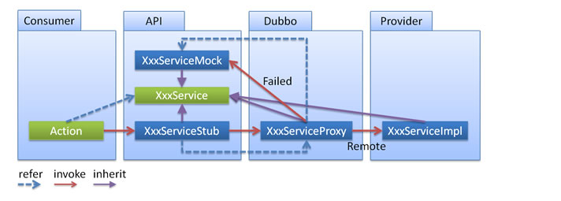

# Dubbo的本地存根(Stub)

**dubbo的本地存根的原理是：**远程服务后，客户端通常只剩下接口，而实现全在服务器端，但提供方有些时候想在客户端也执行部分逻辑，那么就在服务消费者这一端提供了一个Stub类，然后当消费者调用provider方提供的dubbo服务时，客户端生成 Proxy 实例，这个Proxy实例就是我们正常调用dubbo远程服务要生成的代理实例，然后消费者这方会把 Proxy 通过构造函数传给 消费者方的Stub ，然后把 Stub 暴露给用户，Stub 可以决定要不要去调 Proxy。会通过代理类去完成这个调用，这样在Stub类中，就可以做一些额外的事，来对服务的调用过程进行优化或者容错的处理。附图：



**实现步骤：**

**1.定义一个服务接口和服务实现类**

```java
public interface UserInterface {
		public User getUserById(Integer id) ;
}
```

```java
public class UserService implements UserInterface {
    public User getUserById(Integer id) {
        User user  = new User() ;
        user.setId(id);
        user.setName("hu");
        return user;
    }  
}
```

**2.服务导出配置**

```xml
<dubbo:service  interface="org.huxin.dubbo.test.user.service.UserInterface" ref="userService" protocol="dubbo" retries="0"/>

<bean id="userService" class="org.huxin.dubbo.test.user.service.impl.UserService" />
```


**3.服务消费者的Stub类**

```java
public class UserServiceStub implements UserInterface {
    
    //必须定义这个接口，以便接收dubbo在调用远程服务生成的服务代理类
    private UserInterface userLocalService ;
  
    //这个构造函数必须要提供，dubbo框架会在消费者这一方调用这个方法
    public UserServiceStub(UserInterface userLocalService ) {
        this.userLocalService = userLocalService  ;
    }

    public User getUserById(Integer id) {
　　　　　　　　User user = null ;
		　　　　　　　　try {
			　　　　　　　　　　if (id == 1) {
				　　　　　　　　　　　　user =  this.userLocalService.getUserById(id) ;
			　　　　　　　　　　}else {
				　　　　　　　　　　　　user = new User(); 
				　　　　　　　　　　　　user.setName("系统用户");
			　　　　　　　　　　}
		　　　　　　　　}catch(Exception e) {
			　　　　　　　　　　user = new User(); 
			　　　　　　　　　　user.setName("异常用户");
		　　　　　　　　}
              return user ;
    }
}
```


**4. 服务消费方的配置**

```xml
<dubbo:reference id="userService" interface="org.huxin.dubbo.test.user.service.UserInterface" 
                    stub="org.huxin.dubbo.test.UserServiceStub" protocol="dubbo"/>
```


**5.测试代码**

```java
@Test
public void testGetUserById(){
		Integer id = 2 ;
		UserInterface  userService = context.getBean(UserInterface.class) ;
		User user = userService.getUserById( id) ;
		System.out.println(user.getName()); 
}
```


**经测试，dubbo服务端配置存根类好像并没有什么用，默认缺省不要配置以免挖坑。**


