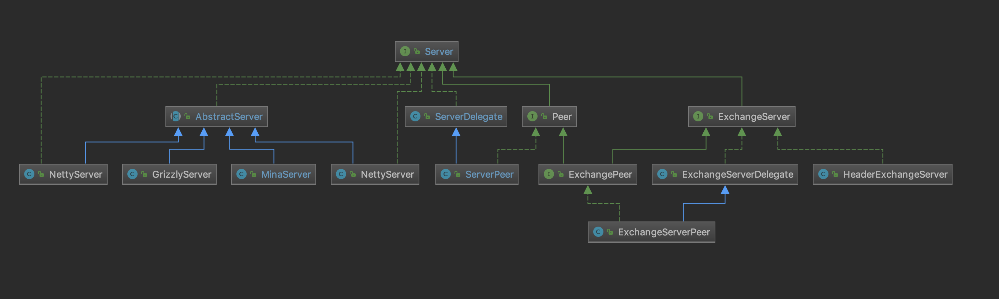
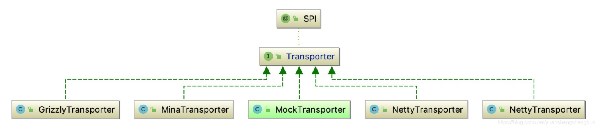
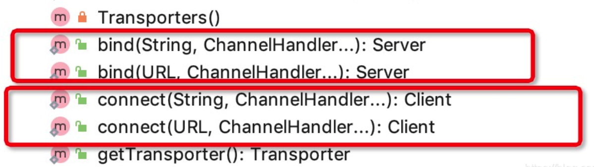
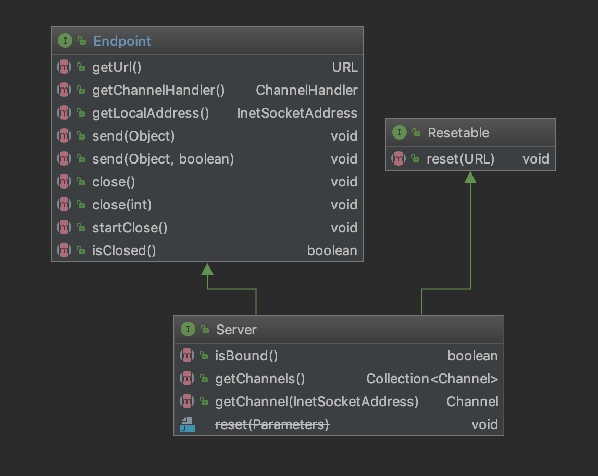
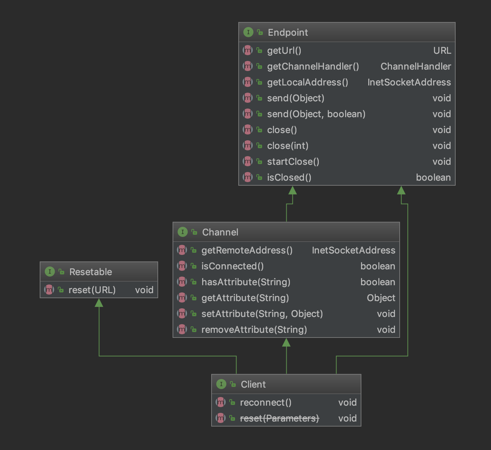
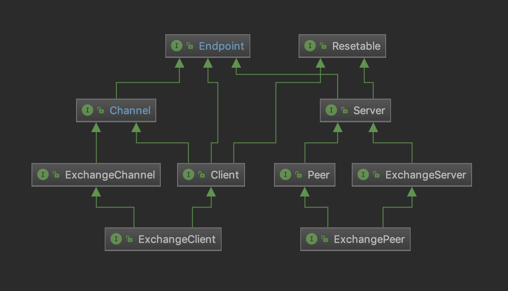

# 网络传输层：Transporter

网络传输层（Transport）：抽象了客户端连接connect与服务端的端口绑定bind方法。


## Transport接口

Transporter是dubbo spi一个扩展点，默认实现类为netty，这里这个netty 是netty4，bind与connect 方法实现会根据@Adaptive上面的server，client ，transporter属性来自适应选择合适的实现类。

Transporter源码：


```java
@SPI("netty")
public interface Transporter {

    /**
     * 服务端通过该方法监听端口消息，通过{@link ChannelHandler}接口处理不同的请求，
     *
     * @param url     server url
     * @param handler
     * @return server
     * @throws RemotingException
     */
    @Adaptive({Constants.SERVER_KEY, Constants.TRANSPORTER_KEY})
    Server bind(URL url, ChannelHandler handler) throws RemotingException;

    /**
     * 客户端通过URL与服务端建立连接
     *
     * @param url     server url
     * @param handler
     * @return client
     * @throws RemotingException
     * @see com.alibaba.dubbo.remoting.Transporters#connect(URL, ChannelHandler...)
     */
    @Adaptive({Constants.CLIENT_KEY, Constants.TRANSPORTER_KEY})
    Client connect(URL url, ChannelHandler handler) throws RemotingException;

}
```


## xml配置




你可以使用client 或者server 属性配置你的网络传输层使用哪个框架实现，比如：

```xml
<dubbo:protocol accesslog="true" name="dubbo" port="18109"  client="mina" server="mina"/>
```

也可以某个引用使用哪个client

```xml
<dubbo:reference interface="com.xuzhaocai.dubbo.provider.IUserInfoService"  client="mina">
```


## Transporters类

Transporters是网络传输层的门面类，它统一了网络传输层的访问入口，提供了一堆bind 与 connect静态方法，与信息交换层的Exchangers功能一致。




### bind方法

我们先来看下它的bind方法：

```java
  public static Server bind(URL url, ChannelHandler... handlers) throws RemotingException {
        //验证
        if (url == null) {
            throw new IllegalArgumentException("url == null");
        }
        if (handlers == null || handlers.length == 0) {
            throw new IllegalArgumentException("handlers == null");
        }
        ChannelHandler handler;
        if (handlers.length == 1) {
            handler = handlers[0];
        } else {   // 多个channal  对 Channel分发   ChannelHandlerDispatcher 循环
            handler = new ChannelHandlerDispatcher(handlers);
        }
        // 真正服务器 进行bind
        return getTransporter().bind(url, handler);
    }
```

首先是检验url与handler，如果是多个handler的话就是用ChannelHandlerDispatcher 这个handler分发器（这个handler就是做某件事的时候就会循环那一堆handler做某件事）封装。最后调用getTransporter 获得具体Transporter 实现，然后调用bind方法。

```java
public static Transporter getTransporter() {  // 获取transporter
        return ExtensionLoader.getExtensionLoader(Transporter.class).getAdaptiveExtension();
}
```

可以看到getTransporter 就是使用dubbo spi技术自适应获得Transporter 的具体实现。


### connect方法

接下来看下connect连接方法的实现：

```java
public static Client connect(URL url, ChannelHandler... handlers) throws RemotingException {
        if (url == null) {
            throw new IllegalArgumentException("url == null");
        }
        ChannelHandler handler;
        if (handlers == null || handlers.length == 0) {
            handler = new ChannelHandlerAdapter();// handler 是null的情况
        } else if (handlers.length == 1) {
            handler = handlers[0];//一个handler的情况
        } else {///多个的情况
            handler = new ChannelHandlerDispatcher(handlers);
        }
        return getTransporter().connect(url, handler);
}
```

在connect方法中可以看到检查url，它是允许handler为空的，如果空的话就创建一个ChannelHandlerAdapter（这里面其实就是一堆空方法，这种就是发出去 不准备接收响应那种），如果是多个handler的话也是使用ChannelHandlerDispatcher 包装下，最后是getTransporter获得具体Transporter然后进行connect连接。


# 信息交换层：Exchanger

## Exchanger层的作用

Exchange层，属于信息交换层，是对Request和Response的抽象。

为什么要单独抽象出一个Exchange层，而不是在Protocol层直接对Netty或者Mina引用？这个问题其实不难理解，Netty或者Mina对外接口和调用方式都不一样，如果在Protocol层直接对Mina做引用，对于Protocol层来讲，就依赖了具体而不是抽象，过几天想要换成Netty，就需要对Protocol层做大量的修改。这样不符合开闭原则。

Dubbo使用的是TCP长连接，与我们开发常见到的HTTP协议（HTTP本身与TCP也不在同一层）不同 。TCP本身没有Request和Response的概念。只有发送和接收。HTTP协议中的Request和Response是由Http服务器或者Servlet容器来实现的。

Dubbo要使用TCP长连接，就得自己实现Request和Response的抽象概念，这样客户端与服务端之间的交互才能有去有回。


## Exchanger接口

先看一下Exchanger的接口定义，就是bind和connect ，bind是服务端调用的，绑定一个端口用来接收客户端的请求。connect是作为一个客户端去连接服务端，进行和服务端交换。

在一个框架中我们通常把负责数据交换和网络通信的组件叫做Exchanger。Dubbo中每个Invoker都维护了一个ExchangeClient的引用，并通过它和远程的Server进行通信。


## EndPoint


### Server



### Channel

### Client




# 接口说明



## EndPoint

终端：描述的是终端机器的具有的能力；

```java
public interface Endpoint {

    /** 用于描述目标机器 */
    URL getUrl();
    /** 获取通道处理器 */
    ChannelHandler getChannelHandler();
    /** 表示当该节点的地址 */
    InetSocketAddress getLocalAddress();

    /** 向通道发送一个消息，可能是客户端向服务端发起请求，也可能是服务端响应客户端请求 */
    void send(Object message) throws RemotingException;
    void send(Object message, boolean sent) throws RemotingException;

    /** 关闭通道 */
    void close();
    /** 优雅的关闭通道 */
    void close(int timeout);
    /** 开始关闭通道 */
    void startClose();
    /** 判断是否已经关闭通道*/
    boolean isClosed();
}
```


### Channel

Channel是连接客户端和服务端的通道，它继承了Endpoint接口，实现Channel接口基本就已经具备了客户端单向的向服务端发送消息的能力：

```java
public interface Channel extends Endpoint {

    /** 获取通道连接的远程地址（可能是dubbo服务的消费方地址，也可能是服务端地址） */
    InetSocketAddress getRemoteAddress();

    /** 判断该通道是否处于连接状态（即客户端和服务端是否处于连接状态） */
    boolean isConnected();


    // 属性相关接口 
    
    boolean hasAttribute(String key);
    Object getAttribute(String key);
    void setAttribute(String key, Object value);
    void removeAttribute(String key);
}
```


#### Client、ExchangeChannel

* Client继承了Channel，再此基础上仅仅添加reconnect的功能，从这里我们可以看出，实现Channel就基本具备了客户端的基础能力；

```java
public interface Client extends Endpoint, Channel, Resetable {
    /** 重置连接，连接服务端 */
    void reconnect() throws RemotingException;

    @Deprecated
    void reset(com.alibaba.dubbo.common.Parameters parameters);
}
```


* 在Channel的基础上增加了request/response语义

```java
public interface ExchangeChannel extends Channel {
    // 发送请求，并返回一个响应信息
    ResponseFuture request(Object request) throws RemotingException;
    ResponseFuture request(Object request, int timeout) throws RemotingException;

    // 通道事件监听处理器
    ExchangeHandler getExchangeHandler();

    // 优雅的关闭
    void close(int timeout);
}
```


##### ExchangeClient

ExchangeClient继承了Client和ExchangeChannel，具备客户端创建连接和request/response信息交换语义

```java
public interface ExchangeClient extends Client, ExchangeChannel {
}
```


### Server

```java
public interface Server extends Endpoint, Resetable {
    /** 判断是否已经建立了用于收发消息的服务 */
    boolean isBound();

    /** 获取服务端所有的Channel */
    Collection<Channel> getChannels();

    /** 获取与指定客户端地址建立连接的通道 */
    Channel getChannel(InetSocketAddress remoteAddress);

    @Deprecated
    void reset(com.alibaba.dubbo.common.Parameters parameters);
}
```


#### Peer、ExchangeServer

* Peer的英文意思是“同等地位的人”，这里Peer的主要作用是将多个服务提供封装为一个服务对外提供，该接口仅提供了一个leave方法，使每个服务都具有从服务组下线的能力

```java
public interface Peer extends Server {
  	// 将当前的服务从服务组移除
    void leave() throws RemotingException;
}
```


* ExchangeServer在Server的基础上增加了ExchangeChannel获取接口方法

```java
public interface ExchangeServer extends Server {
    /** 获取服务端的所有通道 */
    Collection<ExchangeChannel> getExchangeChannels();
    /** 根据客户端地址获取建立连接的通道 */
    ExchangeChannel getExchangeChannel(InetSocketAddress remoteAddress);
}
```

##### ExchangePeer

```java
public interface ExchangePeer extends Peer, ExchangeServer {
}
```


